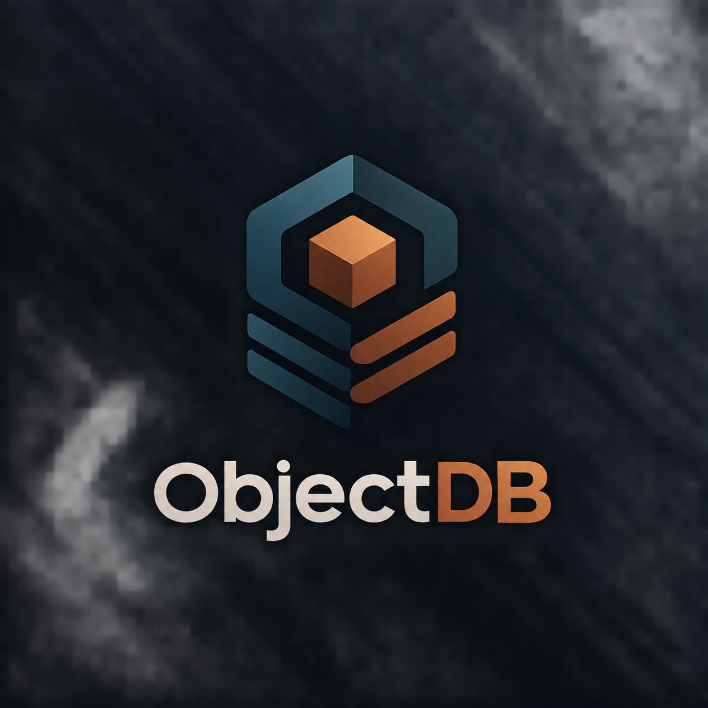

# Object3 — S3-Compatible Object Storage

<p align="center">
  
</p>


An object storage system built from scratch with **Java / Spring Boot**, following the same style as **Amazon S3** — supporting multipart uploads for large files, versioning, HTTP range requests, and **AWS Signature V4** authentication.

The project is split into two main modules:

| Module | Role |
|--------|------|
| **ObjectStoreDB** | The storage server itself — handles S3 requests (upload, download, delete) |
| **AdminAPI** | The control plane — manages users, credentials, and permissions |

The project has **no external dependencies** — files are stored on local disk and metadata lives in **SQLite**, so it runs entirely standalone without Docker or additional services.

---

## Features

### ObjectStoreDB (Storage Server)
- S3-style **path-based API** — `/{bucket}/{object-key}`
- **AWS Signature V4** authentication (same as what AWS CLI and SDKs use)
- Single-shot uploads for small files and **Multipart Upload** for large ones
- **aws-chunked** streaming support for very large uploads
- **Versioning** — every upload gets its own `versionId`
- **HTTP Range** support for partial downloads (resumable downloads / video streaming)
- Download a specific version or the latest one, plus **HEAD** for metadata
- File content on disk, metadata in SQLite

### AdminAPI (Control Plane)
- **HMAC-SHA256** authentication with **timestamps** for replay protection
- User management: create, update, delete (each user gets an `Access Key` + `Secret Key`)
- **Permission** management: `read` / `write` / `delete` / `admin`
- Bucket-level **authorization patterns**: `*` (everything) or `bucket/*`
- Helper endpoint to generate HMAC signatures for testing

---

## Architecture

```
                ┌────────────────────────────────────┐
                │        AdminAPI (8081)             │
                │  Users, credentials, permissions   │
                └──────────────┬─────────────────────┘
                               │ shared database
                               ▼
                 ┌──────────────────────────┐
                 │       SQLite (data.db)   │
                 └──────────────────────────┘
                               ▲
                ┌──────────────┴──────────────┐
                │     ObjectStoreDB (8080)    │
                │   S3-compatible storage     │
                └─────────────────────────────┘

    CLI(will add later) / AWS SDK / any S3 client ──► ObjectStoreDB
        (AWS SigV4 authentication)
```

**Request flow inside ObjectStoreDB:**

1. The client sends a request with an `Authorization: AWS4-HMAC-SHA256 ...` header.
2. `AuthenticationFilter` extracts the AccessKey and Signature from the header.
3. `AuthenticationService` looks up the SecretKey in the database.
4. `SignatureUtils` recomputes the signature (Signing Key → StringToSign → Signature) and compares.
5. `AuthorizationService` checks whether the user holds the permission (`read`/`write`/`delete`) for that bucket/object.
6. The request reaches the controller; any error is returned as **XML**, just like real S3.

**Request flow inside AdminAPI:**

1. The client sends `Authorization: <accessKey>,<timestamp>,<hmac>`.
2. The filter verifies the timestamp is within a 5-minute window (replay protection).
3. `AuthorizeRequestServelet` recomputes the HMAC (signed message: `method:timestamp`) and compares.
4. It verifies the user has the `admin` permission.

---

## Tech Stack

- **Java 17**
- **Spring Boot 4** (Spring MVC + Spring Data JPA)
- **SQLite** (metadata & credential storage)
- **HMAC-SHA256** (signing & authentication)
- **AWS Signature V4** (SigV4)
- **Maven**

---

## Requirements

- Java 17+
- Maven 3.9+

---

## Running

### 1) ObjectStoreDB (storage server) — port 8080

```bash
cd ObjectStoreDB
mvn spring-boot:run
```

### 2) AdminAPI (control plane) — port 8081

```bash
cd AdminAPI
mvn spring-boot:run
```

> Both modules share a single SQLite database (`../data.db`), which is created automatically on first run.

---

## Configuration

### ObjectStoreDB — `src/main/resources/application.properties`

```properties
spring.application.name=ObjectStoreDB
data=data                          # folder for actual object content
spring.servlet.multipart.max-file-size=2GB
spring.servlet.multipart.max-request-size=2GB
```

### AdminAPI — `src/main/resources/application.properties`

```properties
spring.application.name=AdminAPI
server.port=8081
spring.datasource.url=jdbc:sqlite:../data.db
```

**Default admin user** (created automatically on first startup):
`Access Key: admin` — `Secret Key: admin-secret`

---

## Usage

### 1) Create a user (via AdminAPI)

```bash
curl -X POST http://localhost:8081/user \
  -H "Content-Type: application/json" \
  -d '{"accessKey":"dev-user"}'
```

The response returns the user's `secretKey` — use it for signing.

### 2) Generate an HMAC for AdminAPI requests

```bash
curl -X POST http://localhost:8081/user/generateHmac \
  -H "Content-Type: application/json" \
  -d '{"accessKey":"admin","method":"GET"}'
```

### 3) Grant permissions to a user

```bash
# Allow read + write on all buckets
curl -X POST http://localhost:8081/permissions \
  -H "Authorization: <accessKey>,<timestamp>,<hmac>" \
  -H "Content-Type: application/json" \
  -d '{"accessKey":"dev-user","pattern":"*","permissions":["read","write"]}'
```

### 4) Upload and download via AWS CLI

```bash
# configration
S3Client client = S3Client.builder()
                .endpointOverride(URI.create("http://localhost:8080"))
                .forcePathStyle(true)
                .region(Region.US_EAST_1)
                .credentialsProvider(
                        StaticCredentialsProvider.create(
                                AwsBasicCredentials.create(ACCESS_KEY, SECRET_KEY)
                        )
                )
                .build();
# Upload
        PutObjectResponse res = client.putObject(
                PutObjectRequest.builder()
                        .bucket("my-bucket")
                        .key("video.mp4")
                        //.contentLength(Files.size(file))
                        .build(),
                RequestBody.fromFile(file)
        );

# Download
        GetObjectResponse res = client.getObject(
                GetObjectRequest.builder()
                        .bucket("my-bucket")
                        .key("video.mp4")
                        .versionId(versionId)
                        .build(),
                Paths.get("D:/downloaded.mp4")
        );
```

> Compatible with any client using the AWS SDK — authentication is standard SigV4.

---

## API Reference

### ObjectStoreDB — `http://localhost:8080`

| Operation | Method | Path |
|-----------|--------|------|
| Upload small file | `PUT` | `/{bucket}/**` |
| Initiate multipart | `POST` | `/{bucket}/**?uploads` |
| Upload part | `PUT` | `/{bucket}/**?partNumber=N&uploadId=...` |
| Complete multipart | `POST` | `/{bucket}/**?uploadId=...` |
| Abort multipart | `DELETE` | `/{bucket}/**?uploadId=...` |
| Download object | `GET` | `/{bucket}/**?versionId=...` (optional) |
| Partial download | `GET` | `/{bucket}/**` with `Range` header |
| Get metadata | `HEAD` | `/{bucket}/**` |
| Delete object | `DELETE` | `/{bucket}/**?versionId=...` (optional) |

### AdminAPI — `http://localhost:8081`

| Operation | Method | Path |
|-----------|--------|------|
| Get user info | `GET` | `/user/{accessKey}` |
| Create user | `POST` | `/user` |
| Rotate secret key | `PUT` | `/user` |
| Delete user | `DELETE` | `/user/{accessKey}` |
| Generate HMAC | `POST` | `/user/generateHmac` |
| Grant permissions | `POST` | `/permissions` |
| Revoke permission | `DELETE` | `/permissions` |
| Add bucket authorization | `POST` | `/autherization` |
| Remove bucket authorization | `DELETE` | `/autherization` |

---

## Authentication

### AdminAPI — HMAC-SHA256

Every request requires the header:

```
Authorization: <accessKey>,<timestamp>,<signature>
```

- `timestamp` is Unix time (seconds) — requests expire after 5 minutes.
- The signature is computed like this:

```java
String message = method + ":" + timestamp;              // e.g. "GET:1786278600"
Mac mac = Mac.getInstance("HmacSHA256");
// HMAC-SHA256(message, secretKey)
```

### ObjectStoreDB — AWS Signature V4

The header follows the exact AWS format:

```
Authorization: AWS4-HMAC-SHA256 Credential=<accessKey>/<date>/<region>/s3/aws4_request,
               SignedHeaders=host;x-amz-content-sha256;x-amz-date,
               Signature=<signature>
```

Signature derivation (following the official spec):

1. Build the **Canonical Request**
2. Build the **StringToSign**
3. Derive the **Signing Key** from the SecretKey
4. Compute the Signature and compare using `MessageDigest.isEqual`

The `x-amz-date` header must be within 15 minutes of the server time (skew protection).

---

## Project Structure

```
Object3/
├── ObjectStoreDB/                 # Storage server (port 8080)
│   └── src/main/java/org/shalash/objectstoredb/
│       ├── config/                # AuthenticationFilter, SQLiteConfig, TomcatConfig, AutoCreateTable
│       ├── controller/            # FileOperationController (upload/download/delete/multipart)
│       ├── service/               # AuthenticationService, AuthorizationService, FileOperationService
│       ├── repository/            # Credential, Version, Metadata, Authorities
│       ├── utils/                 # SignatureUtils (SigV4), AwsChunkedInputStream, FileUtils
│       ├── dto/                   # Credential, Authorization
│       └── handeler/              # S3ErrorHandler (XML error responses)
│
└── AdminAPI/                      # Control plane (port 8081)
    └── src/main/java/org/shalash/adminapi/
        ├── config/                # AuthenticationFilter, AdminInitializer
        ├── controller/            # User, Permissions, Autherization
        ├── service/               # AdminUserService, AuthorizationService, AuthorizeRequestServelet
        ├── repo/                  # Credential, Authorization, Permissions, UserPermissions
        ├── entity/                # Credentials, Permissions, Autherization, UserPermissions
        ├── dto/                   # API requests & responses
        ├── exception/             # GlobalExceptionHandler
        └── util/                  # Utils (HMAC)
```

---

## Database Schema (SQLite)

```
credentials  (id, access_key, secret_key, active)
permissions  (id, authority)              -- read / write / delete / admin
authorization (id, user_id, pattern)      -- "*" or "bucket/*"
authorization_permission (authorization_id, permission_id)
versions     (id, bucket, object_key, version_id, deleted)
objects      (id, bucket, object_key, version_id, size, content_type)
```

---

## Testing

```bash
# ObjectStoreDB
cd ObjectStoreDB
mvn test

# AdminAPI
cd AdminAPI
mvn test
```

